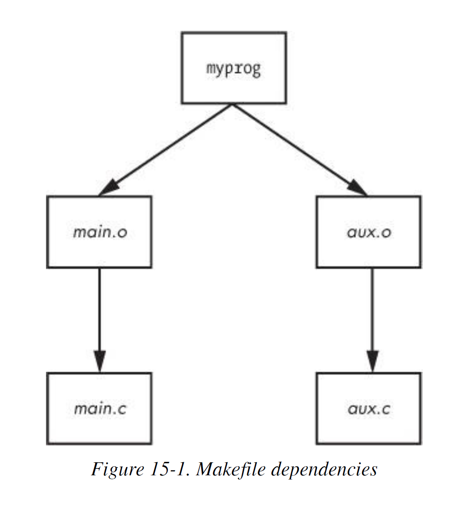

# Chapter 15 - Development Tools

Created by : Mr Dk.

2019 / 07 / 11 17:00

@NUAA, Nanjing, Jiangsu, China

---

## 15.1 The C Compiler

大部分 Unix 系统上 C 编译器是 GNU C compiler - `gcc`

而 LLVM 中的 `clang` 正越来越受欢迎

```bash
$ cc hello.c
```

会生成 `a.out` 的可执行文件

当然也可以生成指定名称的可执行文件：

```bash
$ cc -o hello hello.c
```

### 15.1.1 Multiple Source Files

使用 `-c` 选项将源文件编译为目标文件：

```bash
$ cc -c main.c
```

得到 `main.o`

* 但 OS 不知道如何执行目标文件
* 需要将目标文件和系统库文件合并为完整的程序

为了产生完整的可执行程序，需要运行链接器

程序员很少需要在 cmd 中使用 `ld` 命令进行显示链接

这些工作会由编译器完成

```bash
$ cc -o my_program main.o other.o
```

### 15.1.2 Header (Include) Files and Directories

C 头文件是包含类型和函数库函数声明的部分

很多时候，编译器发生错误的原因是找不到头文件

#### Fixing Include File Problems

Unix 中默认的 include 目录是 `/usr/include`

编译器会自动在该目录中找头文件

如果想指定一个 include 目录：

```bash
$ cc -c -I/usr/somewhere/include main.c
```

```c
# include "myheader.h"
// # include <myheader.h>
```

#### What Is the C Preprocessor (cpp)?

C 预处理器是编译器在开始转换源代码之前首先运行的程序

处理源代码中的宏指令，包含三种类型：

* Include files - `#include ...`

  编译器会根据默认路径或 `-I` 选项寻找对应头文件

* Macro definitions - 预处理器会替代源代码中所有的宏定义部分

* Conditionals - `#ifdef`, `#if`, `#endif`

C 预处理器对 C 的语法一无所知，只认识宏指令

在 Unix 中，C 的预处理器名称是 `cpp`

### 15.1.3 Linking with Libraries

C 库是一个预编译的函数集合

在链接阶段开始被引入

最有可能出现的问题是找不到库中的某个函数

在命令中，需要使用 `-l` 来链接对应的库

系统默认回到 `/usr/lib` 中寻找对应的库

库文件 - `libgobject.a`

* 库的名称是 `gobject`

如果某个库位于非默认路径，则需要用 `-L` 参数来告诉链接器库的位置：

```bash
$ cc -o main main.o -lgobject -L/usr/somewhere/lib -lcrud
```

### 15.1.4 Shared Libraries

以 `.a` 结尾的库文件被称为静态库

当链接静态库时，链接器将库文件中的机器码拷贝到程序中

因此，最终的可执行文件不需要原库文件被运行

当原库文件改变时，可执行文件的行为不会改变

然而，随着库文件越来越大，静态库太占用磁盘空间和内存空间

此外，如果发现静态库中存在漏洞

在不重新编译可执行文件的条件下，无法更新可执行文件中的库代码

共享库解决了这些问题：

* 系统在执行的程序需要用到共享库时才将库代码载入进程地址空间
* 多个进程可以共享内存中相同的库代码
* 如果需要改动库代码，不需要重新编译可执行文件

共享库的问题：

* 复杂的管理
* 复杂的链接过程

#### Listing Shared Library Dependencies

共享库文件通常和静态库的位置相同：`/lib` 和 `/usr/lib`

* `/lib` 目录通常不包含静态库

共享库的后缀 `.so` - shared object

使用 `ldd` 命令查看程序使用的所有动态库：

```bash
$ ldd /bin/bash
        linux-vdso.so.1 (0x00007ffe0d4ee000)
        libtinfo.so.5 => /lib/x86_64-linux-gnu/libtinfo.so.5 (0x00007f7ac707d000)
        libdl.so.2 => /lib/x86_64-linux-gnu/libdl.so.2 (0x00007f7ac6e79000)
        libc.so.6 => /lib/x86_64-linux-gnu/libc.so.6 (0x00007f7ac6a88000)
        /lib64/ld-linux-x86-64.so.2 (0x00007f7ac75c1000)
```

可执行文件自身通常不知道共享库的具体位置

`ld.so` (运行时动态装入/链接器) 在运行时寻找并装入共享库

#### How ld.so Finds Shared Libraries

动态链接器通常遇到的问题是找不到库

动态链接器会寻找的第一个地方是可执行文件预先配置的 _runtime library search path (rpath)_

下一步，动态链接器会在系统缓存 `/etc/ld.so.cache` 中查看库是否在默认位置

这是 `/etc/ld.so.conf` 的快速缓存

`ld.so.conf` 文件的每一行都是想要引入的路径

标准库路径 `/lib` 和 `/usr/lib` 是隐含的，不需要额外配置

如果改动了 `ld.so.conf` 中的目录，需要 rebuild `/etc/li.so.cache` 文件：

```bash
$ ldconfig -v
```

`ld.so` 还会在一个地方寻找共享库：环境变量 `LD_LIBRARY_PATH`

#### Linking Programs Against Shared Libraries

```bash
$ cc -o main main.o -Wl,-rpath=/opt/... -L/opt/... -lweird
```

`-Wl` 和 `-rapth` 告诉链接器将对应的目录加入到可执行程序的运行时库搜索路径中

#### Programs with Shared Libraries

* Missing libraries
* Terrible performance
* Mismatched libraries

首先可能导致问题的地方是 `LD_LIBRARY_PATH` 环境变量

* `ld.so` 会优先从环境变量中搜索共享库

不要在 shell 启动文件或编译软件时设置该环境变量：

* 运行时动态链接器会遍历该变量中的所有路径，从而导致性能问题
* 同时还会导致冲突和不匹配的库，因为运行时链接器在这些路径中为每个程序寻找共享库

如果一定要使用该环境变量，应当在 wrapper script 中设置该环境变量：

```shell
#!/bin/sh
LD_LIBRARY_PATH=/opt/...
export LD_LIBRARY_PATH
exec /opt/.../...bin $@
```

避免使用该环境变量避免了大部分共享库问题

---

## 15.2 make

有多个源程序或需要大量编译选项的程序

直接手动编译很困难

`make` 解决了这个问题

`make` 背后的基本思想是 _target_

* 一个用户想要完成的目标
* 目标可以是一个文件或可执行文件

此外，一些目标可能会依赖其它目标，即所谓的 _dependencies_

为了 build 一个目标，`make` 会遵守规则

* 比如如何将 `.c` 文件转换为 `.o` 文件

### 15.2.1 A Sample Makefile

```makefile
# object files
OBJS=aux.o main.o

all: myprog

myprog: $(OBJS)
	$(CC) -o myprog $(OBJS)
```

* `#` 是 makefile 中的注释
* `OBJS` 是变量，在之后可以被引用：`$(OBJS)`
* 第一个目标：`all`
  * 第一个目标是 make 的默认目标
* 对于 `all`，需要满足的目标是 `myprog`，即依赖
  * `myprog` 可以是另一个目标，也可以是文件
* 宏展开后：`myprog: aux.o main.o`，说明 `myprog` 依赖这两个文件

```bash
$ make
cc    -c -o aux.o aux.c
cc    -c -o main.o main.c
cc -o myprog aux.o main.o
```



### 15.2.2 Built-in Rules

内置规则：比如寻找与 `.o` 文件同名的 `.c` 文件，并将 `.c` 文件转换为 `.o` 文件

### 15.2.3 Final Program Build

必须在实际命令面前插入一个 tab

### 15.2.4 Staying Up-to-Date

运行 `make` 命令后，再次运行

`make` 查看规则，发现 `all` 已经存在

* 如果 `all` 的依赖都没有发生改变，将不再 rebuild
* 如果其中的某一个依赖发生了改变，只 rebuild 依赖发生改变的部分，引发链式反应

### 15.2.5 Command-Line Arguments and Options

在运行 make 命令时，可以执行宏：

```bash
$ make CC=clang
```

两个常用的 option：

* `-n` - 打印 build 过程中必须的命令，但 make 实际上不运行对应的命令
* `-f file` - 从指定文件运行 make，而不是 `Makefile` 或 `makefile`

### 15.2.6 Standard Macros and Variables

`make` 中的特殊宏和变量：

* `CFLAGS` - C 编译器的选项，make 会将这些参数传递给编译器
* `LDFLAGS` - 链接器选项
* `LDLIBS` - 链接的库名称
* `CC` - C 编译器
* `CPPFLAGS` - C 预处理器选项
* `CXXFLAGS` - C++ 编译器选项
* `$@` - 在规则内部，被扩展为当前目标
* `$*` - 被扩展为当前目标的 basename

### 15.2.7 Conventional Targets

几个标准的目标：

* `clean` - 清除所有的目标文件和可执行文件

  ```makefile
  clean:
  	rm -f $(OBJS) myprog
  ```

* `install` - 将编译后的程序拷贝到 Makefile 认为合适的位置

  * 可以运行 `make -n install` 来模拟执行一遍

* `test` / `check` - 在一次 build 之后测试可用性

* `all` - 通常代表 Makefile 中的第一个目标

### 15.2.8 Organizing a Makefile

```makefile
MYPACKAGE_INCLUDES=-I/usr/local/include/mypackage
MYPACKAGE_LIB=-L/usr/local/lib/mypackage -lmypackage

CFLAGS=$(CFLAGS) $(MYPACKAGE_INCLUDES)
LDFLAGS=$(LDFLAGS) $(MYPACKAGE_LIB)
```

如果两个可执行文件需要用到同一个文件中的代码：

```makefile
UTIL_OBJS=util.o

BORING_OBJS=$(UTIL_OBJS) boring.o
TRITE_OBJS=$(UTIL_OBJS) trite.o

PROGS=boring trite
```

最终是编译的部分：

```makefile
all: $(PROGS)

boring: $(BORING_OBJS)
	$(CC) -o $@ $(BORING_OBJS) $(LDFLAGS)
	$(CC) -o $@ $(TRITE_OBJS) $(LDFLAGS)
```

---

## 15.3 Debuggers

为了启用程序的调试功能

在编译程序时加入 `-g` 选项

* 将符号表和其它调试信息写入可执行文件

进入 `(gdb)` 的命令模式：

```bash
$ gdb <program>
```

带参数运行程序：

```bash
(gdb) run <options>
Starting program: /home/zhangjingtang/main
Hello world
[Inferior 1 (process 7617) exited normally]
```

打印变量的值：

```bash
(gdb) print <variable>
```

设断点：

```bash
(gdb) break <file>:<line>
```

继续执行：

```bash
(gdb) continue
```

清除断点：

```bash
(gdb) clear <file>:<line>
```

---

