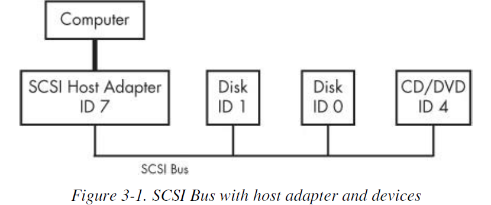
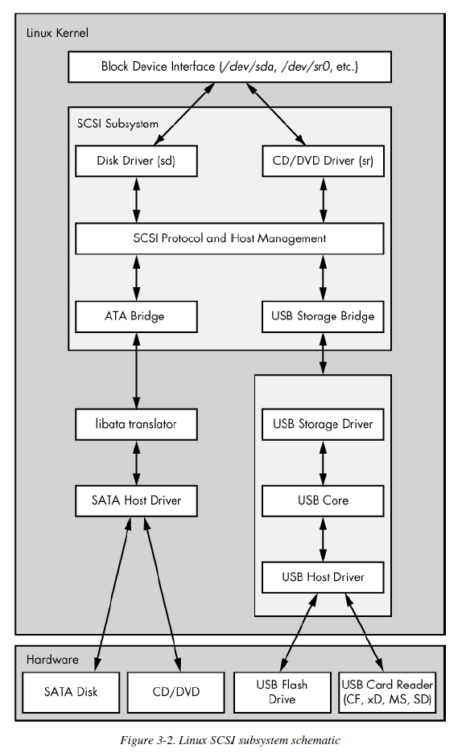
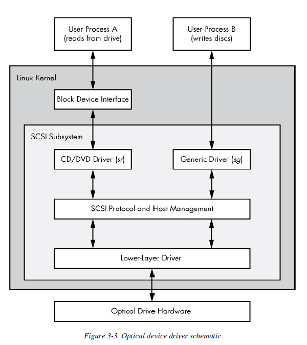

# Chapter 3 - Devices

Created by : Mr Dk.

2019 / 06 / 15 10:46

@Nanjing, Jiangsu, China

---

理解当内核发现新设备时，如何与用户空间进行交互

udev 系统使用户空间程序能够自动配置并使用新设备

* 内核如何通过 udev 向用户进程发消息？

---

## 3.1 Device Files

Unix 系统中将大部分设备的 I/O 接口表示为文件

这些设备文件有时被称为 _device nodes_

* 用户可以使用普通的文件操作使用设备
* 设备也可以被一些操作文件的标准程序使用 (cat 等)

但并不是所有设备都可以通过标准文件 I/O 来使用

在 Linux 中，设备文件位于 `/dev` 目录下

运行命令可以查看所有的设备文件：

```bash
[root@izuf6ewwd5zlnpjggtr0b4z ~]# ls -l /dev/
total 0
crw------- 1 root root     10, 235 Jan  5 23:56 autofs
drwxr-xr-x 2 root root          80 Jan  6 07:56 block
crw------- 1 root root     10, 234 Jan  5 23:56 btrfs-control
drwxr-xr-x 3 root root          60 Jan  5 23:56 bus
drwxr-xr-x 2 root root        2620 Jan  5 23:56 char
crw------- 1 root root      5,   1 Jan  5 23:56 console
lrwxrwxrwx 1 root root          11 Jan  6 07:56 core -> /proc/kcore
drwxr-xr-x 3 root root          80 Jan  5 23:56 cpu
crw------- 1 root root     10,  61 Jan  5 23:56 cpu_dma_latency
crw------- 1 root root     10,  62 Jan  5 23:56 crash
drwxr-xr-x 4 root root          80 Jan  6 07:56 disk
drwxr-xr-x 2 root root          80 Jan  6 07:56 dri
crw-rw---- 1 root video    29,   0 Jan  5 23:56 fb0
lrwxrwxrwx 1 root root          13 Jan  6 07:56 fd -> /proc/self/fd
crw-rw-rw- 1 root root      1,   7 Jan  5 23:56 full
crw-rw-rw- 1 root root     10, 229 Jan  5 23:56 fuse
crw------- 1 root root    249,   0 Jan  5 23:56 hidraw0
crw------- 1 root root     10, 228 Jan  5 23:56 hpet
drwxr-xr-x 2 root root           0 Jan  5 23:56 hugepages
crw------- 1 root root     10, 183 Jan  5 23:56 hwrng
lrwxrwxrwx 1 root root          25 Jan  5 23:56 initctl -> /run/systemd/initctl/fifo
drwxr-xr-x 4 root root         280 Jan  5 23:56 input
crw-r--r-- 1 root root      1,  11 Jan  5 23:56 kmsg
srw-rw-rw- 1 root root           0 Jan  6 07:56 log
crw-rw---- 1 root disk     10, 237 Jan  5 23:56 loop-control
drwxr-xr-x 2 root root          60 Jan  5 23:56 mapper
crw------- 1 root root     10, 227 Jan  5 23:56 mcelog
crw-r----- 1 root kmem      1,   1 Jan  5 23:56 mem
drwxrwxrwt 2 root root          40 Jan  5 23:56 mqueue
drwxr-xr-x 2 root root          60 Jan  5 23:56 net
crw------- 1 root root     10,  60 Jan  5 23:56 network_latency
crw------- 1 root root     10,  59 Jan  5 23:56 network_throughput
crw-rw-rw- 1 root root      1,   3 Jan  5 23:56 null
crw------- 1 root root     10, 144 Jan  5 23:56 nvram
crw------- 1 root root      1,  12 Jan  5 23:56 oldmem
crw-r----- 1 root kmem      1,   4 Jan  5 23:56 port
crw------- 1 root root    108,   0 Jan  5 23:56 ppp
crw-rw-rw- 1 root tty       5,   2 Jun 14 13:58 ptmx
drwxr-xr-x 2 root root           0 Jan  5 23:56 pts
crw-rw-rw- 1 root root      1,   8 Jan  5 23:56 random
drwxr-xr-x 2 root root          60 Jan  5 23:56 raw
lrwxrwxrwx 1 root root           4 Jan  5 23:56 rtc -> rtc0
crw------- 1 root root    253,   0 Jan  5 23:56 rtc0
drwxrwxrwt 2 root root          40 Jan  6 07:56 shm
crw------- 1 root root     10, 231 Jan  5 23:56 snapshot
drwxr-xr-x 2 root root          80 Jan  5 23:56 snd
lrwxrwxrwx 1 root root          15 Jan  6 07:56 stderr -> /proc/self/fd/2
lrwxrwxrwx 1 root root          15 Jan  6 07:56 stdin -> /proc/self/fd/0
lrwxrwxrwx 1 root root          15 Jan  6 07:56 stdout -> /proc/self/fd/1
brw-rw---- 1 root disk    253,   0 Jan  5 23:56 vda
brw-rw---- 1 root disk    253,   1 Jan  5 23:57 vda1
drwxr-xr-x 2 root root          60 Jan  5 23:56 vfio
crw------- 1 root root     10,  63 Jan  5 23:56 vga_arbiter
crw------- 1 root root     10, 137 Jan  5 23:56 vhci
crw------- 1 root root     10, 238 Jan  5 23:56 vhost-net
drwxr-xr-x 2 root root          60 Jan  6 07:56 virtio-ports
crw------- 1 root root    248,   1 Jan  5 23:56 vport1p1
crw-rw-rw- 1 root root      1,   5 Jan  5 23:56 zero
```

比如：

```bash
$ echo emm > /dev/null
```

将输出重定向到了一个文件中，而这个文件实际上对应了一个设备

由内核来决定如何处理写入该设备的数据

* 对于 `/dev/null` 来说，内核会忽略所有的输入，并将数据丢掉...... 😅

```bash
$ ls -l
brw-rw---- 1 root disk    253,   0 Jan  5 23:56 vda
crw------- 1 root root     10, 235 Jan  5 23:56 autofs
prw-r--r-- 1 root root           0 Mar  3 19:17 fdata
srw-rw-rw- 1 root root           0 Jan  6 07:56 log
```

File mode 的第一个字符如果是 `b` / `c` / `p` / `s`，那么该文件对应一个设备

* `b` - block device
* `c` - character device
* `p` - pipe device
* `s` - socket device

### Block Device

程序以固定大小的 chunks 从 block device 中访问数据

比如 __磁盘设备__

由于每个 chunk 大小固定，且易于索引

进程可以在内核的帮助下随机访问 block

### Character Device

这类设备的工作基于 __data streams__

只能对这类设备写入字符或读取字符

这类设备没有大小的概念

* 在进程中进行 read 或 write 的行为时，内核会通过驱动在设备上进行 read 或 write 操作
* 在数据被传输到设备或者进程之后，内核 __不会__ 备份或重新检验数据流

比如 __打印机__ 属于这类设备

### Pipe Device

这类设备和 character device 设备类似

但是 I/O stream 的另一端是另一个进程，而不是一个内核驱动

### Socket Device

用于进程间通信的特殊用途接口

通常在 `/dev` 目录之外

此外，前两行中日期之前的两个数字是设备的主要编号和次要编号

帮助内核识别设备

类似的设备通常都有类似的主要编号

__不是所有的设备都有设备文件，因为文件 I/O 接口不适用于所有的场景。__

## 3.2 The sysfs Device Path

`/dev` 目录中只有很少一部分的设备信息

Linux 内核通过 sysfs 接口，通过文件和目录

提供了查看设备真实硬件参数的统一视角

基路径位于 `/sys/devices`

* `/dev` 使用户进程能够使用设备
* `/sys/devices` 用于查看信息和管理设备
* 其中可能包含很多的符号链接，所以需要用 `ls -l` 来查看真实 sysfs 路径

在 `/sys/devices` 查找 `/dev` 中的路径可能很难

可以使用 `udevadm` 命令查找：（比如查找 `/dev/sda` 在 sysfs 下的路径）

```bash
$ udevadm info --query=all --name=/dev/sda
```

## 3.3 dd and Devices

`dd` 程序在 block devices 或 character devices 中非常有用

程序功能：

* 从输入流或输入文件中读取
* 写入输出文件或输出流
* 可能顺带做一些编码转换工作

`dd` 以固定块大小拷贝数据：

```bash
$ dd if=/dev/zero of=new_file bs=1024 count=1
```

* `if=file` - the input file
* `of=file` - the output file
* `bs=size` - the block size
  * `ibs=size`
  * `obs=size`
  * 用于输入输出的 block size 不同
* `count=num` - the total number of blocks to copy
* `skip=num` - 在输入文件或输入流中跳过前 num 个块，不拷贝到输出中

参数格式与其它 Unix 命令不同：IBM Job Control Language (JCL) style

## 3.4 Devices Name Summary

### 3.4.1 Hard Disks: /dev/sd*

内核为磁盘上的每个分区分别创建设备文件

### 3.4.2 CD and DVD Drivers: /dev/sr*

### 3.4.3 PATA Hard Disks: /dev/hd*

### 3.4.4 Terminals: /dev/tty\*, /dev/pts/\*, and /dev/tty

### 3.4.5 Serial Ports: /dev/ttyS*

### 3.4.6 Parallel Ports: /dev/lp0 and /dev/lp1

### 3.4.7 Audio Devices: /dev/snd/*, /dev/dsp, /dev/audio, and More

## 3.5 udev

内核检测到新设备以后，向用户空间进程 udevd 发送通知

udevd 检查新设备的属性，创建设备文件，并进行设备初始化

问题：

很多设备在启动过程中就需要被使用

所以 udevd 必须很早启动

为了创建设备文件，udevd 也不应该依赖于任何它应该创建的设备文件

同时，还需要启动迅速，以防止系统不会因为 udevd 的启动而等待

### 3.5.1 devtmpfs

devtmpfs 文件系统被用于解决 boot 期间设备可用性的问题

内核会创建必需的设备文件，并通知 udevd 一个新设备可用

在接收到信号后，udevd 不创建设备文件

但进行设备初始化和进程通知

此外，还在 `/dev` 中创建符号链接用于识别设备

### 3.5.2 udevd Operation and Configuration

udevd 守护进程的操作过程：

1. 内核通过内部网络链路向 udevd 发送通知事件 - _uevent_
2. udevd 读取 uevent 中的所有参数
3. udevd 转换规则，并根据规则做一些动作或设置一些参数

### 3.5.3 udevadm

udevadm 程序是一个 udevd 管理工具

* 对系统设备进行搜索
* 监控内核向 udevd 发送的 uevents

### 3.5.4 Monitoring Devices

```bash
$ udevadm monitor
```

---

## 3.6 In-Depth SCSI and the Linux Kernel

Small Computer System Interface - SCSI

传统的 SCSI 硬件由一个 host adapter 连接 SCSI 总线上的一串设备构成的

Host Adapter 再连接到电脑



Host Adapter 和每个设备都有 SCSI ID

* 根据 SCSI 版本，决定每个总线上可以有 8 或 16 个 ID

Host Adapter 通过 SCSI 命令与设备通信

电脑不直接操作设备，而是通过 adapter 转接

运行命令：

```bash
$ lsscsi
[0:0:0:0]  disk    ATA    WDC  WD3200AAJS-2  01.0  /dev/sda
```

编号含义（从左到右）：

* SCSI host adapter number
* SCSI bus number
* Device SCSI ID
* Logical Unit Number

SCSI 子系统及其三层驱动：



* 最顶层处理一类设备的操作
  * 比如将内核中的 block device 请求转换为 SCSI 协议中对应的命令，反之亦然
* 中间层转发上层和下层之间的 SCSI 消息，并追踪系统连接的所有 SCSI 总线和设备
* 最下层处理硬件相关的操作
  * 将 SCSI 消息发送到特定的 host adapters 上，反之亦然
  * 同一类设备的 SCSI message 是统一的，不同的 host adapter 对发送相同的 message 有着不同的步骤

### 3.6.1 USB Storage and SCSI

### 3.6.2 SCSI and ATA

### 3.6.3 Generic SCSI Devices

用户空间通过 block device interface 操作 SCSI 子系统

因此不需要知道 SCSI 协议的细节

但用户可以通过 _generic devices_ 绕过 block device interface

直接向设备发送 SCSI 命令



---

