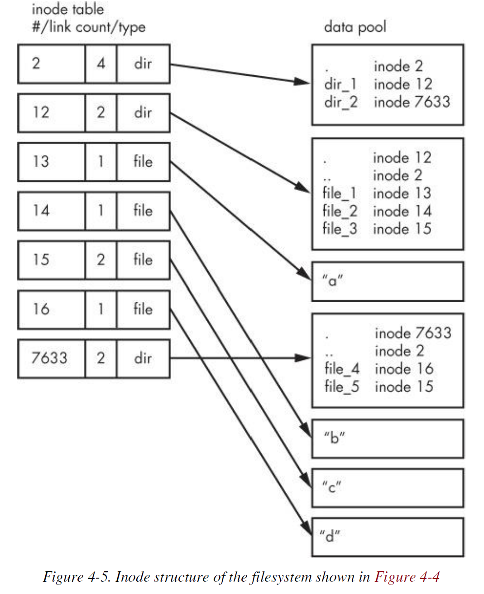

# Chapter 4.3-4.5 - Swap Space & Inside a Traditional Filesystem

Created by : Mr Dk.

2019 / 06 / 22 09:16

CRH Train G7687 @Somewhere in Anhui, China

---

## 4.3 Swap Space

不是每一个磁盘分区上都有文件系统

RAM 空间与磁盘空间进行对换也是有可能的

如果真实内存用尽

Linux 虚拟内存系统会自动将一些内存片段放入磁盘空间

_swapping_

* 将一些空闲的程序换到磁盘
* 将一些活跃的程序换到内存

磁盘空间上用于存储内存页的区域叫做 _swap space (swap)_

`free` 命令能够输出目前交换空间的使用情况 (kB)

```bash
$ free
              total        used        free      shared  buff/cache   available
Mem:        8311928     4298916     3783660       17720      229352     3879280
Swap:      23314172      105696    23208476
```

### 4.3.1 Using a Disk Partition as Swap Space

1. 一个空白的分区
2. `mkswap dev` - `dev` 为分区设备
   * 该命令会将分区标记为交换分区
3. `swapon dev` - 为内核注册交换分区

在 `/etc/fstab` 中加入新的条目

### 4.3.2 Using a File as Swap Space

如果在当前情况下不能对磁盘进行重新分区

可以使用一个文件作为交换分区

1. 创建一个指定大小的空文件
2. 初始化为交换分区
3. 将其加入交换分区池

```bash
$ dd if=/dev/zero of=<swap_file> bs=1024k count=<num_mb>
$ mkswap <swap_file>
$ swapon <swap_file>
```

### 4.3.3 How Much Swap Do You Need?

在以前，swap 分区通常要设定为两倍于内存左右的大小空间

现在，一方面由于内存越来越大

另一方面由于磁盘空间也越来越大

因此，并不一定要满足这一传统规则了

---

## 4.4 Looking Forward: Disks and User Space

---

## 4.5 Inside a Traditional Filesystem

传统的 Unix 文件系统有两个主要组成部分：

* 数据块池 - 用于存放数据
* 一个数据库系统 - 用于管理数据池

数据库系统以 __inode__ 数据结构为中心

* 一种数据结构
* 描述一个特定文件/目录
* 类型、权限
* 数据存放在数据块池中的哪些位置

Inodes 由 inode table 中的编号被识别

文件名和目录也由 inode 实现

* 包含了目录下一系列的文件名和目录名
* 和这些子目录子文件对应的 inode 的链接信息



寻找一个文件的过程：

1. 将文件的路径根据 `/` 逐级拆分
2. 在 inode table 中找到 root inode 的条目，查找 root inode 在数据块池中的位置
3. 在 root inode 中找到对应的文件或目录，得到下一级的 inode 编号
4. 在 inode table 中找到该 inode 编号对应在数据块池中的位置，找到对应的 inode
5. 重复上述过程，直到找到最终的 inode

注意：

目录的 inodes 中还包含了对于自身 inode 和上一级 inode 的引用

### 4.5.1 Viewing Inode Details

查看任何一个目录的 inode 编号 - `ls -i`

Hard-link - `ln A B`

* 只是在 inode table 中创建了一个条目，指向了一个已经存在的 inode
* 不会额外创建新的 inode

删除时怎么办？

* 删除 inode 条目时，数据块池中对应的 inode 也被删除
* 硬链接的另一个 inode 条目将无法引用到 inode

inode table 中存在 __link count__ 域：

* 创建目录 inode 时，link count 初始化为 2
  * inode 自身引用
  * 父目录引用
* 创建文件 inode 时，link count 初始化为 3
  * 父目录引用
* 创建硬链接时，直接将 link count + 1
* 删除文件或目录时，根据 link count 的具体值来决定要不要删除 inode
  * 比如删除硬链接文件时，只将 link count - 1
  * 若 link count 为 0 再删除 inode
* 一个例外：root inode 的 link count 会多一个
  * 文件系统的 superblock 的引用
  * 用于寻找 root inode

之前使用的 `fsck` 文件系统检查程序会遍历所有的 inode

* 重新计算所有的 link count
* 并与已有的 link count 进行比较
* 如果不匹配，会将存在问题的 inode 放在 _lost+found_ 目录下

### 4.5.2 Working with Filesystems in User Space

虽然用户空间有权限查看 inode 等信息

* 通过 `stat()` 系统调用

但用户不需要关心文件系统的实现细节

不是所有 Linux 支持的文件系统都有这样的实现方式

Linux 的 _Virtual File System (VFS)_ 接口保证了系统调用每次返回 inode 和 link count

但不能保证返回的值有意义

* 也不能在 FAT 文件系统上使用 `ln` 创建硬链接

### 4.5.3 The Evolution of Filesystems

文件系统的技术在不断变化

* `Btrfs` - 下一代文件系统，正在开发中

新的文件系统数据结构肯定会不太一样

此外，对 SSD 的优化文件系统也在不断进化

但是，文件系统的不断进化没有改变其原有的本质功能

---

